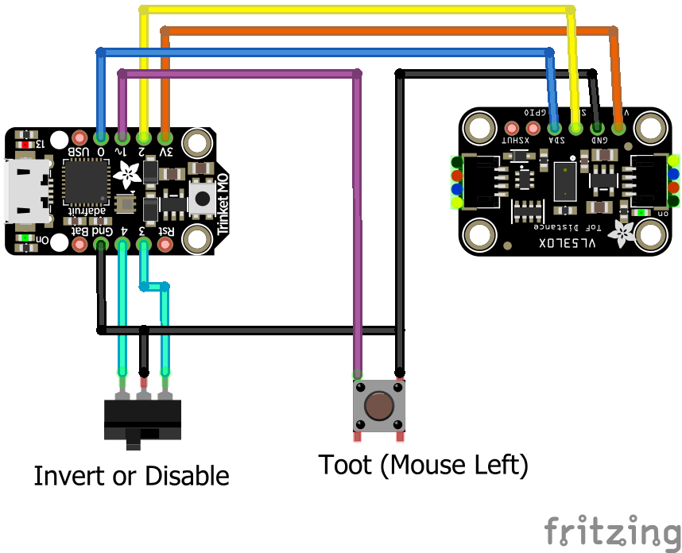

# Controller for trombone champ game

Control Trombone Champ by emulating a mouse with a [Trinket m0](https://www.adafruit.com/product/3500) and VL53L0X distance sensor.

This is a simplified version of [my QT PY controller](https://github.com/dwesely/trombone_champ_qtpy).

## Operation

### Select mode

3-way switch allows orientation to be inverted, or to disable the mouse emulation (so it doesn't interfere with operation outside the game).

When the switch is in the middle, no movement reports will be sent, and the scroll wheel (rotary encoder) will be operational.

When the switch is on one side, the distance measured by the device will be translated to the mouse position on the screen (farther distance = higher mouse).
When the switch is on the opposite side, the distance will be inverted (farther distance = lower mouse).

### Toot

The momentary switch clicks the left mouse button, activating toot.

### Scaling Factor

The scaling factor is hard-coded. This value makes the maximum detected distance higher or lower. This is used to make operation more comfortable for people with different sizes of arms.

### Precision
Precision is hard-coded with a timing budget of 30ms.

## Other features 

Software debounce using the Adafruit debounce library to clean up "toot" command signal.

On board RGB LED indicates which which timing budget is selected, so the measurement precision can be changed without recoding.

JST connectors for input devices. 

### Libraries used
* adafruit_vl53l0x
* adafruit_ticks
* adafruit_debouncer
* adafruit_bus_device
* [mouse_abs](https://gist.github.com/bitboy85/cdcd0e7e04082db414b5f1d23ab09005)

### Parts list
* Trinket M0 (Digikey: 1528-2361-ND)
* ANT13SECQE 3-way switch SPDT, ON-OFF-ON (Digikey: 2449-ANT13SECQE-ND)
* Momentary switch
* JST connector sets (x1 2-pin, x1 3-pin, x1 4-pin)
* Generic toy foam dart gun as a project case (dollartree.com: SKU 323010)

### Connections

## Lessons learned
* The Trinket M0 will throw an overflow error with the absolute mouse package I'm using. I avoid it by changing "0xFFFFFFFF" to "0xFFFFFFF" (dropping one "F")
* The toy gun worked very well as a case, there was fairly little modification
* Software debouncing was not noticeably different from hardware debouncing
* I didn't miss the rotary encoder
